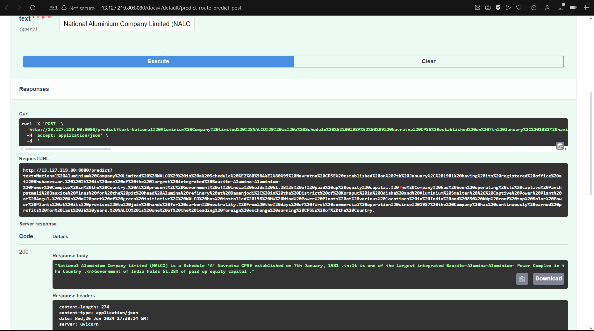
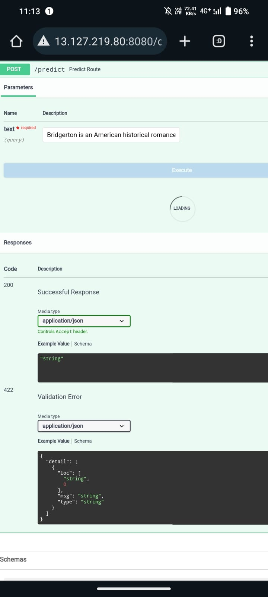
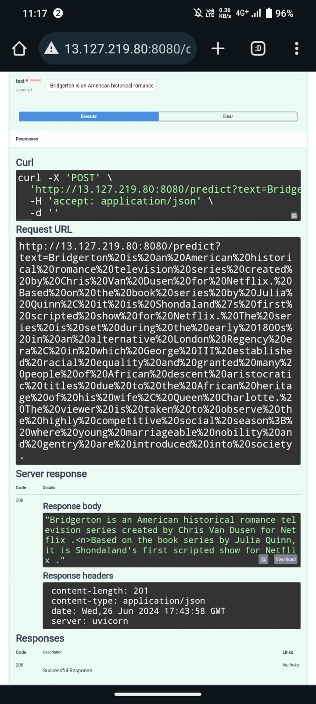

# Text-Summarization Project

## STEPS:

Clone the repository

```bash
https://https://github.com/Kshitij-Nishant/Text-Summarization
```

### STEP 01- Create a conda environment after opening the repository

```bash
conda create -n summary python=3.8 -y
```

```bash
conda activate summary
```

### STEP 02- install the requirements
```bash
pip install -r requirements.txt
```

### STEP 03- run template.py to create required folders
```bash
python template.py
```

### STEP 04- Do research in notebooks and put those codes into respective folders based on Workflow

#### WORKFLOW followed for each stage:

1. Update config.yaml
2. Update params.yaml
3. Update entity
4. Update the configuration manager in src config
5. update the components
6. update the pipeline
7. update the main.py

8. Check the complete flow of code execution:

```bash
python  main.py
```

9. After each stage use below to push to Github:

```bash
git add .
git commit -m "<Put Caption here on the updates>"
git push origin main
```

### STEP 05- Make prediction pipeline in pipeline folder

Add the prediction pipeline and Update the app.py

check for complete flow of code execution in FastAPI:

```bash
# Finally run the following command
python  app.py
```

Now,
```bash
open up you local host and port
```

......Push to git after 


```bash
Author: Kshitij Nishant
Data Scientist Practitioner
Email: kshitijnishant09@gmail.com
```

# AWS-CICD-Deployment-with-Github-Actions

## 1. Login to AWS console.

## 2. Create IAM user for deployment

	#with specific access

	1. EC2 access : It is virtual machine

	2. ECR: Elastic Container registry to save your docker image in aws


	#Description: About the deployment

	1. Build docker image of the source code

	2. Push your docker image to ECR

	3. Launch Your EC2 

	4. Pull Your image from ECR in EC2

	5. Lauch your docker image in EC2

	#Policy:

	1. AmazonEC2ContainerRegistryFullAccess

	2. AmazonEC2FullAccess

	
## 3. Create ECR repo to store/save docker image
    - Save the URI: 381492009295.dkr.ecr.ap-south-1.amazonaws.com/textsum

	
## 4. Create EC2 machine (Ubuntu) 

## 5. Open EC2 and Install docker in EC2 Machine:
	
	
	#optinal

	sudo apt-get update -y

	sudo apt-get upgrade
	
	#required

	curl -fsSL https://get.docker.com -o get-docker.sh

	sudo sh get-docker.sh

	sudo usermod -aG docker ubuntu

	newgrp docker
	
# 6. Configure EC2 as self-hosted runner:
    setting>actions>runner>new self hosted runner> choose os> then run command one by one


# 7. Setup github secrets:

    AWS_ACCESS_KEY_ID=

    AWS_SECRET_ACCESS_KEY=

    AWS_REGION = ap-south-1

    AWS_ECR_LOGIN_URI = demo>>  381492009295.dkr.ecr.ap-south-1.amazonaws.com

    ECR_REPOSITORY_NAME = simple-app

# Demonstration:

## 1. For the below Desktop screenshots I provided the text:

<b>Input Text:</b>

"National Aluminium Company Limited (NALCO) is a Schedule ‘A’ Navratna CPSE established on 7th January, 1981 having its registered office at Bhubaneswar.  It is one of the largest integrated Bauxite-Alumina-Aluminium- Power Complex in the Country. At present, Government of India holds 51.28% of paid up equity capital. The Company has been operating its captive Panchpatmali Bauxite Mines for the pit head Alumina refinery at Damanjodi, in the District of Koraput in Odisha and Aluminium Smelter & Captive Power Plant at Angul.  As a part of green initiative, NALCO has installed 198 MW Wind Power Plants at various locations in India and 850 kWp roof top Solar Power Plants at its premises to join hands for carbon neutrality. From the days of first commercial operation since 1987 the Company has continuously earned profits for last 36 years. NALCO is one of the leading foreign exchange earning CPSEs of the Country."

<b>Output Text</b>:

"National Aluminium Company Limited (NALCO) is a Schedule ‘A’ Navratna CPSE established on 7th January, 1981 .<n>It is one of the largest integrated Bauxite-Alumina-Aluminium- Power Complex in the Country .<n>Government of India holds 51.28% of paid up equity capital ."

     
	



## 2. Below is a demonstration for mobile device:

For mobile, I gave a rather longer paragraph description of the show "Bridgerton" and this is the summary I got back from the model.

<b>Input Text:</b>

"Bridgerton is an American historical romance television series created by Chris Van Dusen for Netflix. Based on the book series by Julia Quinn, it is Shondaland's first scripted show for Netflix. The series is set during the early 1800s in an alternative London Regency era, in which George III established racial equality and granted many people of African descent aristocratic titles due to the African heritage of his wife, Queen Charlotte. The viewer is taken to observe the highly competitive social season; where young marriageable nobility and gentry are introduced into society.

The first season debuted on December 25, 2020. The second season premiered on March 25, 2022. Part one of the third season premiered on May 16, 2024, with part two following on June 13, 2024.[1] The series was renewed for a fourth season in April 2021.[2][3] In May 2023, Queen Charlotte: A Bridgerton Story, a spin-off series focused on Queen Charlotte, was released.

Bridgerton was positively received for its direction, actors' performances, production and set design, winning two Primetime Creative Arts Emmy Awards, a Make-Up Artists And Hair Stylists Guild Awards, and nominations at the Primetime Emmy Awards, Screen Actors Guild Awards, Satellite Awards and NAACP Image Awards. The music score by Kris Bowers earned a Grammy Award nomination for Best Score Soundtrack for Visual Media."

<b>Output Text</b>:

"Bridgerton is an American historical romance television series created by Chris Van Dusen for Netflix .<n>Based on the book series by Julia Quinn, it is Shondaland's first scripted show for Netflix ."






<b><i>We can see from the second images, respectively, that the whole paragraph has been summarized to a few lines with a good enough information. Hence demonstrating the model's efficiency in understanding the keywords and giving the user valuable insight about the subject in lesser lines in and under a minutes time.</i></b>

<i>(PS: We can also increase the number of words in summarized paragraph.)</i>

# Usecase:

* <b><u>In filtering long written rage and vulgar comments</u></b>: It will be more computationally efficient if the Filter model takes in the summarized text of this model and use it as it's input.

* <b><u>Summarizing comments on a product</u></b>: User's buying a product can go through the summary of all the comments made on the product from previous buyers rather than going through each comment just to understand if the product is worth it or not.

* <b><u>Creating Headlines for an article</u></b>: In a world filled with information, headlines serve as the first point of contact, grabbing the reader's attention and enticing them to read further and provides a quick summary of the article or news piece, giving readers an idea of what to expect.